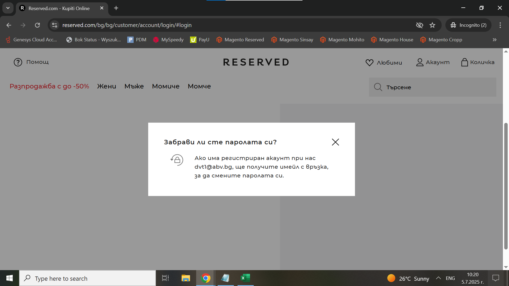

# Bug Report: The functionality for forgotten password isn't working properly

## *ID*: BR-001  
## *Date*: 2025-07-02  
## *Status*: Open  
## *Severity*: High 
## *Priority*: High  

---

## Description

When a user clicks the "Забравили сте паролата си?" button and enters their already registered profile, he doesn't receive an email to change his password.

---

## Preconditions

- The user dvt1@abv.bg is registered
- Already loaded Login page

---

## Steps to reproduce

1. Click on "Забрави ли сте паролата си?" 
2. In pop-up window in "Имейл" field type "dvt1@abv.bg"
3. Click on "Изпращане" button

---

## Expected results

The user should see the following message: *Ако има регистриран акаунт при нас dvt1@abv.bg, ще получите имейл с връзка, за да смените паролата си.* and after that he should received an email for change his password.

---

## Actual results

The user see the following message *Ако има регистриран акаунт при нас dvt1@abv.bg, ще получите имейл с връзка, за да смените паролата си.*, but he doesn't receive an email for change his password.

---

### Screenshot:

---

## Environment

* **OS**: Windows 10  
* **Browser**: Google Chrome 138.0.7204.97 (Official Build) (64-bit)
* **Test environment**: Staging

---

## Additional information

