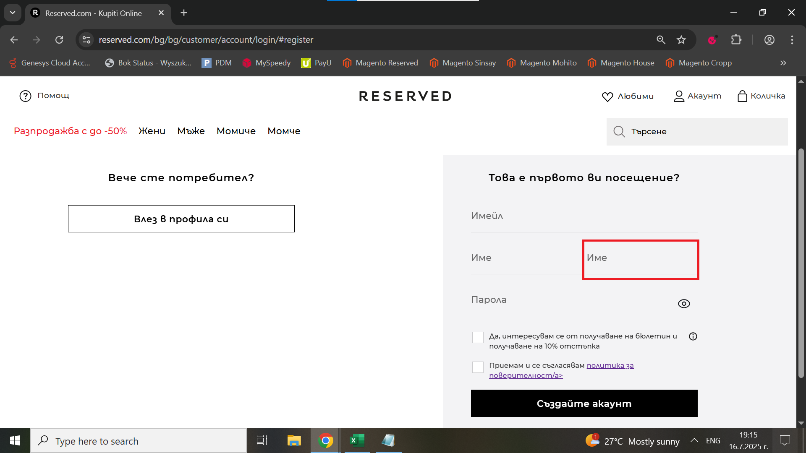

# Bug Report: Incorrect label name in the registration form

## *ID*: BR-002  
## *Date*: 2025-07-16  
## *Status*: Open  
## *Severity*: Low 
## *Priority*: Medium  

---

## Description

When the user opens the registration form in online shop, he see two identical labels in registration form.

---

## Preconditions

- Already loaded Home page

---

## Steps to reproduce

1. Place the your cursor over "Акаунт" on the right top corner
2. Click on "РЕГИСТРАЦИЯ" button

---

## Expected results

When the user opens the registration form in the online shop, it should contain the following elements:
- "Помощ" button; 
- RESERVED logo in the center on the page;
- "Любими" button;
- "Акаунт" button; 
- "Количка" button;
- Cathegory drop-down menu;
- Search bar;
- "Имейл" field;
- "Име" field; 
- "Фамилия" field;
- "Парола" field;
- "Да, интересувам се от получаване на бюлетин и получаване на 10% отстъпка" checkbox;
- "Приемам и се съгласявам политика за поверителност" checkbox;
- "Създайте акаунт" button 

---

## Actual results

When the user opens the registration form in online shop, it contain the following elements:
- "Помощ" button; 
- RESERVED logo in the center on the page;
- "Любими" button;
- "Акаунт" button; 
- "Количка" button;
- Cathegory drop-down menu;
- Search bar;
- "Имейл" field;
- "Име" field; 
- "Име" field;
- "Парола" field;
- "Да, интересувам се от получаване на бюлетин и получаване на 10% отстъпка" checkbox;
- "Приемам и се съгласявам политика за поверителност" checkbox;
- "Създайте акаунт" button 

---

### Screenshot:

---

## Environment

* **OS**: Windows 10  
* **Browser**: Google Chrome 138.0.7204.97 (Official Build) (64-bit)
* **Test environment**: Staging

---

## Additional information

