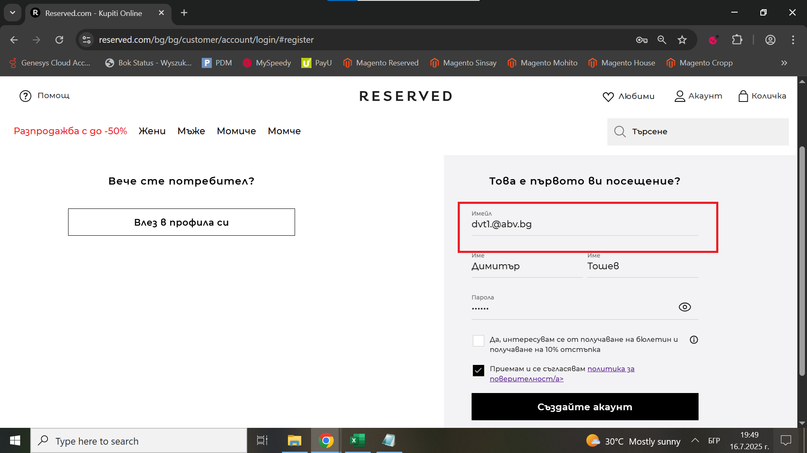
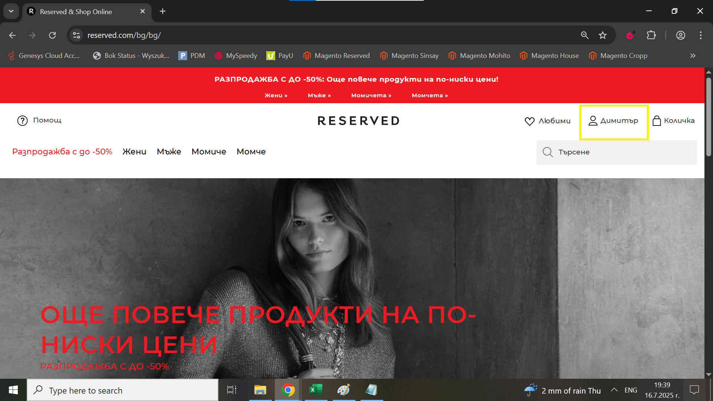

# Bug Report: User can register a profile with an invalid email

## *ID*: BR-003  
## *Date*: 2025-07-16  
## *Status*: Open  
## *Severity*: Low 
## *Priority*: High 

---

## Description

When the user enters an invalid email address in registration form, they can succesfully create a profile in online shop.

---

## Preconditions

- Already loaded Register form

---

## Steps to reproduce

1. Type in "Имейл" field - "dvt1.@abv.bg";
2. Type in "Име" field - "Димитър";
3. Type in second "Име" field - "Toшев";
4. Type in  "Парола" field - "123456";
5. Click on "Приемам и се съгласявам политика за поверителност/a>" checkbox;
6. Click on "Създайте акаунт" button

---

## Expected results

After the user enters an incorrect email in the field, the message "Моля, въведете валиден имейл адрес" should appear, and after clicking "Създайте акаунт" they shouldn't be able to register the account in website.

---

## Actual results

After the user enters an incorrect email in field, the message "Моля, въведете валиден имейл адрес" doesn't appear, and even after clicking "Създайте акаунт" the user is able to successfully register the account in website.

---

### Screenshot:

---

## Environment

* **OS**: Windows 10  
* **Browser**: Google Chrome 138.0.7204.97 (Official Build) (64-bit)
* **Test environment**: Staging

---

## Additional information
