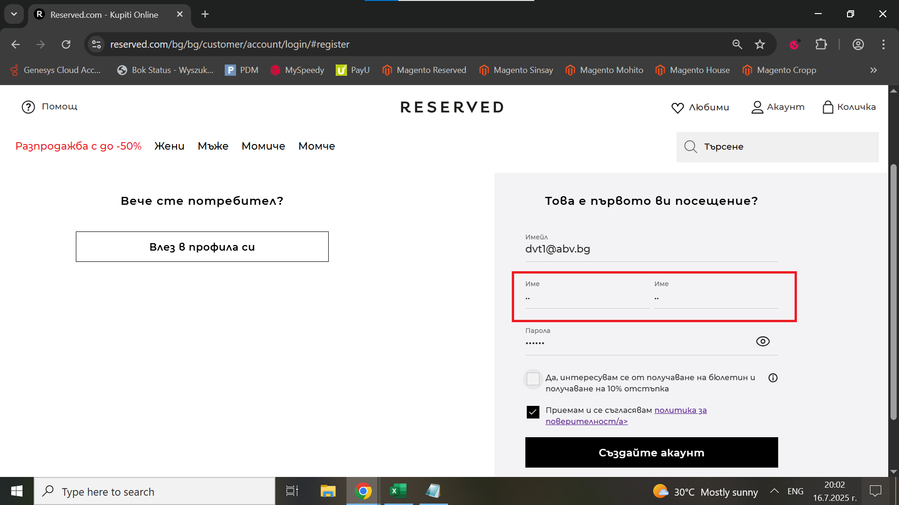
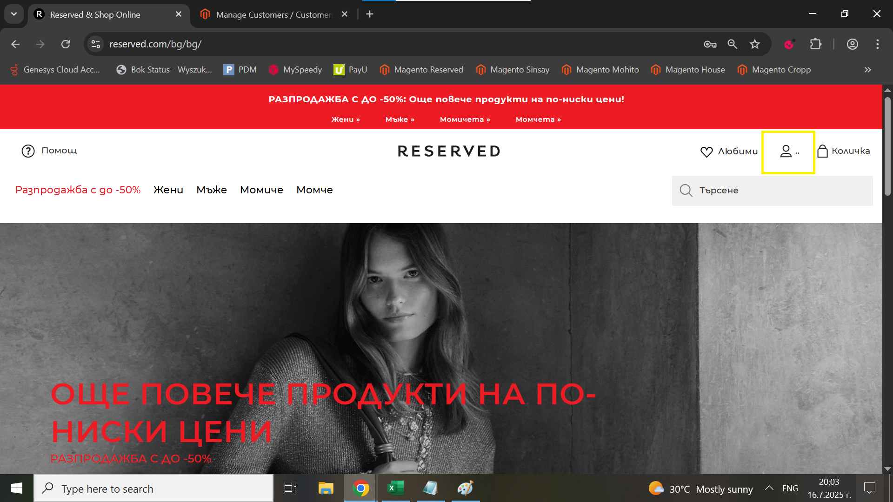

# Bug Report: The user can register a profile with a name and surname containing only special characters

## *ID*: BR-004  
## *Date*: 2025-07-16 
## *Status*: Open  
## *Severity*: Low 
## *Priority*: High 

---

## Description

When the user enters special characters in the "Име" and "Фамилия" fields in registration form,  they can successfully create a profile.

---

## Preconditions

- Already loaded Register form

---

## Steps to reproduce

1. Type in "Имейл" field - "dvt1@abv.bg";
2. Type in "Име" field - "..";
3. Type in second "Име" field - "..";
4. Type in  "Парола" field - "123456";
5. Click on "Приемам и се съгласявам политика за поверителност/a>" checkbox;
6. Click on "Създайте акаунт" button

---

## Expected results

When the user types special characters instead of letters in the two fields for names, they shouldn't be able to register a profile.

---

## Actual results

When the user types special characters inteasd of letters in the fields for the names, they can successfully register a profile.

---

### Screenshot:

---

## Environment

* **OS**: Windows 10  
* **Browser**: Google Chrome 138.0.7204.97 (Official Build) (64-bit)
* **Test environment**: Staging

---

## Additional information
