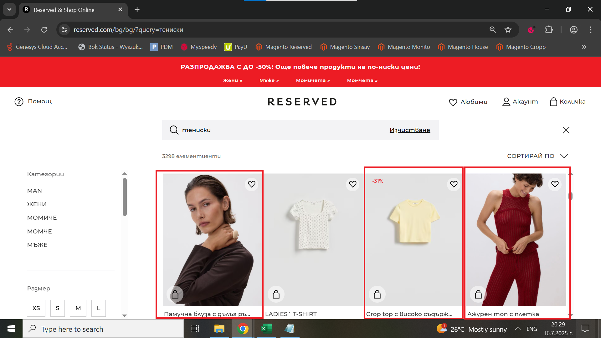

# Bug Report: The Search bar shows incorrect results

## *ID*: BR-005  
## *Date*: 2025-07-16  
## *Status*: Open  
## *Severity*: Medium 
## *Priority*: Medium

---

## Description

When the user searches for t-shirts in the search bar, the results display different types of products, such as tops and blouses with long sleeves.

---

## Preconditions

- Already loaded Home page

---

## Steps to reproduce

1. Click on "Търсене";
2. Enter "Тениски";
3. Check the results

---

## Expected results

When the user searches "Тениски" in search bar, only products with the word "Тениски" in the title should be displayed.

---

## Actual results

When the user searches for "Тениски" in search bar, they see different types of products instead of only products with word in title "Тениски".

---

### Screenshot:

---

## Environment

* **OS**: Windows 10  
* **Browser**: Google Chrome 138.0.7204.97 (Official Build) (64-bit)
* **Test environment**: Staging

---

## Additional information
