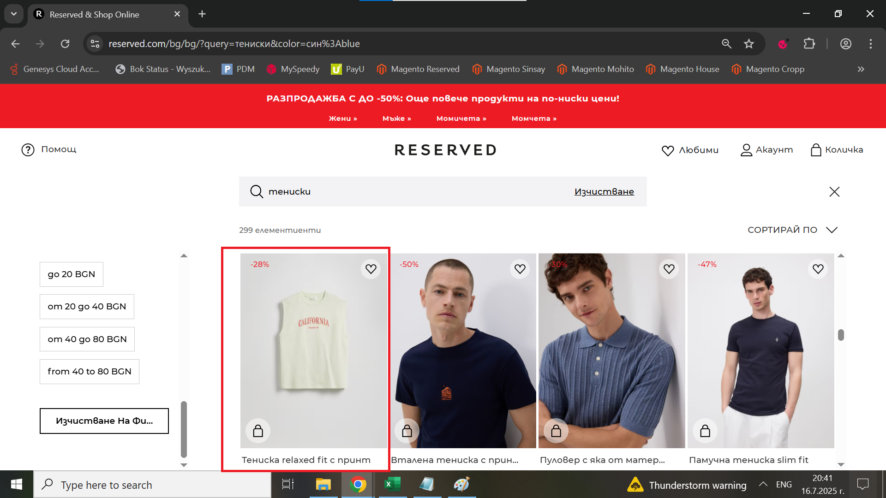

# Bug Report: Incorrect color filtering results in the search bar

## *ID*: BR-006
## *Date*: 2025-07-16  
## *Status*: Open  
## *Severity*: Medium 
## *Priority*: Medium

---

## Description

When the user selects the color "Син" from the sidebar, the search results display "Син" color as well as other colors.

---

## Preconditions

- Already loaded Home page

---

## Steps to reproduce

1. Click on "Търсене";
2. Enter "Тениски";
3. In filter sidebar with name "Категории" choose "Син" color;
4. Check the results

---

## Expected results

When the user selects the color "Син"  from sidebar, the search results should display only products with color "Син".

---

## Actual results

When the user selects the color "Син" from sidebar, the search results display beige, red and other colors.

---

### Screenshot:

---

## Environment

* **OS**: Windows 10  
* **Browser**: Google Chrome 138.0.7204.97 (Official Build) (64-bit)
* **Test environment**: Staging

---

## Additional information
