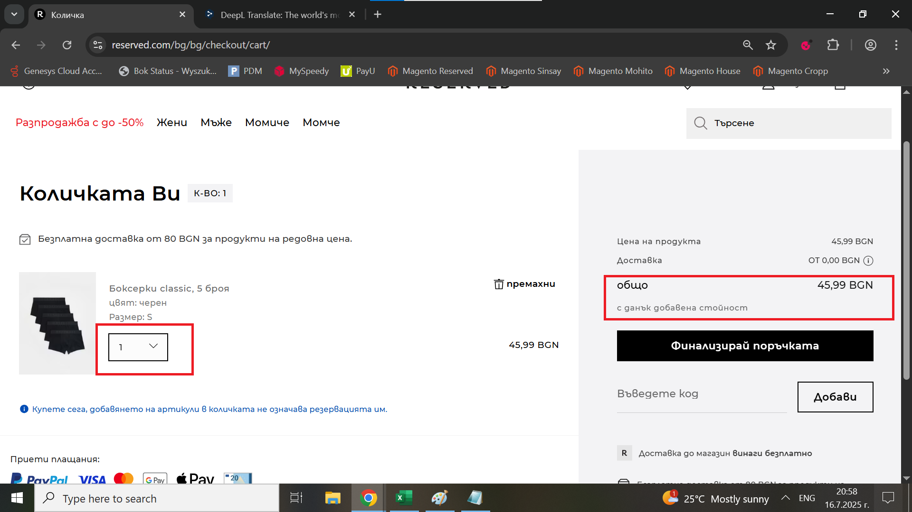

# Bug Report: Issue with updating the quantity and total price in the Checkout

## *ID*: BR-007
## *Date*: 2025-07-16  
## *Status*: Open  
## *Severity*: Medium 
## *Priority*: High

---

## Description

When the user chooses to change the quantity of the product in the Checkout, the quantity and total price in car aren't updated.

---

## Preconditions

- Already open checkout page, already added a product with index 8360v-99x-S in checkout

---

## Steps to reproduce

1. Click on dropdown menu for quantity of the product;
2. Change quantity from 1 item to 7 items;

---

## Expected results

When the user changes the quantity from 1 to 7 items in the Checkout, both the quantity and total price should update accordingly.

---

## Actual results

When the user changes the quantity from 1 to 7 items in the Checkout, the quantity and total price are still the same like before.

---

### Screenshot:

---

## Environment

* **OS**: Windows 10  
* **Browser**: Google Chrome 138.0.7204.97 (Official Build) (64-bit)
* **Test environment**: Staging

---

## Additional information
