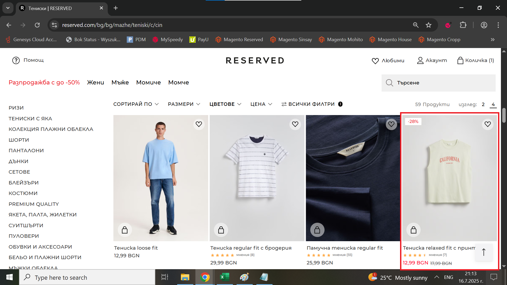

# Bug Report: Incorrect color filtering on the product page 

## *ID*: BR-008
## *Date*: 2025-07-16  
## *Status*: Open  
## *Severity*: Medium 
## *Priority*: High

---

## Description

When the user selects the "Син" color from the filtering bar, they see the results with different colors, such as beige.

---

## Preconditions

- Already loaded page with Men T-shirts

---

## Steps to reproduce

1. Click on "ЦВЕТОВЕ" from filtering bar in product page;
2. Click on "син" color;
3. Click on "ПРИЛОЖИ" button

---

## Expected results

When the user chooses the blue color from the filtering bar on product page, they should see only blue men's t-shirts 

---

## Actual results

When the user chooses the blue color from the filtering bar on product page, they see a beige t-shirt in the results

---

### Screenshot:

---

## Environment

* **OS**: Windows 10  
* **Browser**: Google Chrome 138.0.7204.97 (Official Build) (64-bit)
* **Test environment**: Staging

---

## Additional information
